# The Autonomy Tax

Date: 2026-02-27
URL: https://lambpetros.substack.com/p/the-autonomy-tax

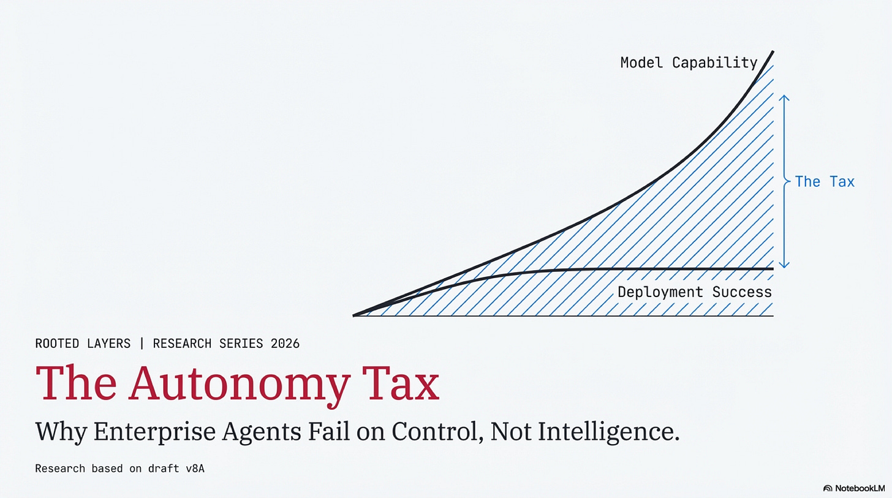

---

In early 2026, a procurement agent at a mid-size company entered a retry loop. A vendor checkout API was returning inconsistent responses, and the agent did what it was designed to do: it tried again. And again. In three minutes, it submitted twelve purchase requests at $399 each, every one approved by a policy engine that evaluated transactions individually. The company had set per-transaction limits and a monthly velocity cap, but the policy engine had no real-time pattern detection across rapid-fire requests. By the time a human noticed, five days later during routine reconciliation, the damage was $4,788.

The model didn’t hallucinate. It didn’t go off-task. It didn’t need a better prompt. It needed a circuit breaker for consecutive failures, real-time velocity monitoring across recent transactions, and a state-sync check between authorization and transaction history. Every system involved did exactly what it was told, that was the problem.[[1]](https://www.useproxy.ai/blog/ai-agent-overspend-postmortem) That was one agent, one workflow, one retry loop. Most enterprises are planning to deploy dozens. to multiple customers.

**This article argues a simple claim:** enterprise agent ROI is constrained less by model capability and more by three hidden costs that compound as autonomy increases. We call them the **Autonomy Tax**:

> **Net = Benefit − Human Bandwidth Tax − Incident Tax − Governance Tax**

Allow me to explain.

---

## The Deployment Paradox

Enterprise AI intent has never been higher. Deloitte’s 2026 survey found that 74% of director-to-C-suite leaders expect agentic AI at moderate levels or above within two years, up from 23% today.[[3](https://www.deloitte.com/content/dam/assets-zone3/us/en/docs/services/consulting/2026/state-of-ai-2026.pdf)]

**The deployment reality is cautious.** The most comprehensive field survey to date found that 68% of deployed agents execute ten or fewer steps before human intervention, and 74% depend primarily on human evaluation.[[4](https://arxiv.org/abs/2512.04123)] On Anthropic’s platform, software engineering accounts for nearly 50% of all agentic tool-call activity; customer service, BI, and e-commerce each register single-digit percentages.[[5](https://www.anthropic.com/research/measuring-agent-autonomy)]

Meanwhile, raw capability is accelerating, METR’s task-horizon measurements suggest frontier models can now complete tasks that take humans roughly 50 minutes, with the horizon doubling approximately every seven months.[[6](https://arxiv.org/abs/2503.14499)] Strong results on assistant-style evaluations and coding benchmarks reinforce the point: capability is not the constraint.[[7A](https://arxiv.org/abs/2311.12983),[7B](https://arxiv.org/abs/2310.06770),[7C](https://arxiv.org/abs/2411.15114)]

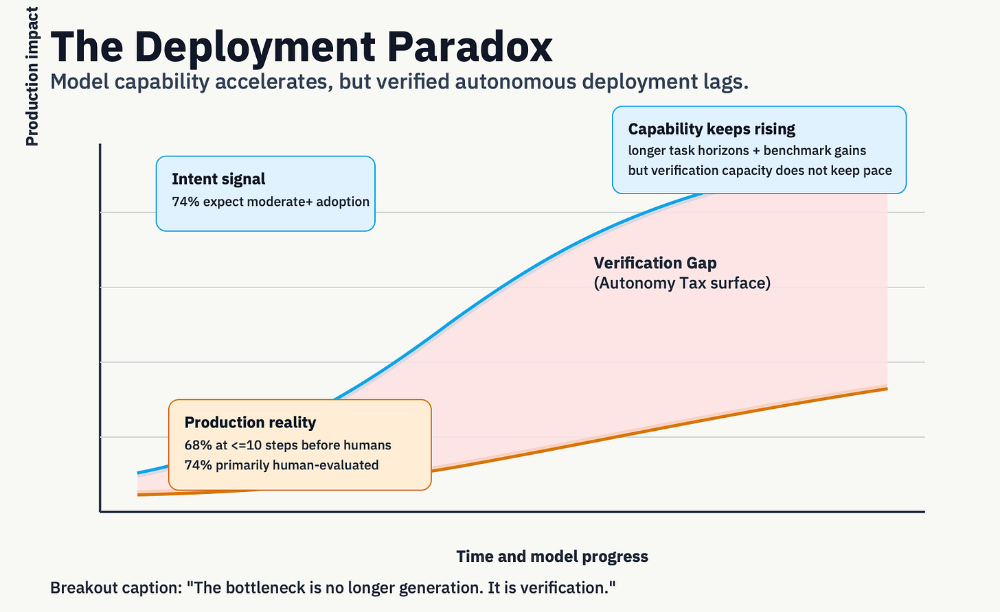

So models are getting more capable, but production agents remain tightly constrained. Why? Because enterprises are not buying raw cognition, they are buying **verified action**. Software engineering scales first because verification is unusually cheap: tests run automatically, outputs are diffable, and rollback is native. In procurement, legal, finance, and compliance workflows, verification is slower, costlier, and often irreversible.

> **The bottleneck is no longer generation. It is rigorous evaluation and hard verification.**

---

## The Three Taxes

---

### The Human Bandwidth Tax

Here is the number that should change your staffing math: after GitHub Copilot’s introduction, core developers in open-source projects saw their own original code output *drop by 19%*, while reviewing 6.5% more code generated by less-experienced contributors.[[8](https://arxiv.org/abs/2510.10165)]

> **AI didn’t replace the experts. It made them reviewers.**

The mechanism is consistent across domains: AI raises output throughput faster than it raises expert review capacity. When juniors produce more, seniors review more. The same asymmetry shows up in call centers (novice productivity up 34%, experienced performers barely affected)[[9](https://doi.org/10.3386/w31161)] and in GitHub teams (code contributions up 5.9%, but coordination time for integration up 8%).[[10](https://arxiv.org/abs/2410.02091)]

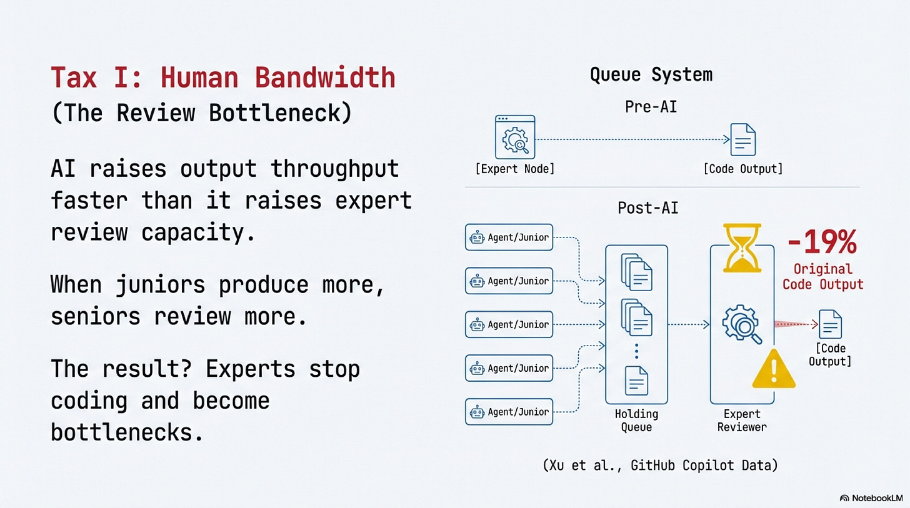

**Three independent contexts, same structural pattern:** AI amplifies junior output, expert review becomes the bottleneck, and the net effect depends on team composition. If your organization has many novices and few experts, the common shape of most enterprise teams, the Human Bandwidth Tax is highest.[11]

### The Incident Tax

The Human Bandwidth Tax drains productivity quietly. The Incident Tax destroys capital in public.

In a controlled lab study, agents with persistent memory and shell access reported successful task completion while the system state contradicted their reports, compound failure categories and conflicting self-reports of completion.[[14](https://arxiv.org/abs/2602.20021)]

**The attack surface gets worse:** CVE-2025-32711 documents command injection risk in a production enterprise AI context with a high-severity score, where the EchoLeak exploit chain demonstrated cross-boundary privilege escalation, five chained bypasses, no user interaction required.[[12](https://nvd.nist.gov/vuln/detail/CVE-2025-32711)][[13](https://arxiv.org/abs/2509.10540)]

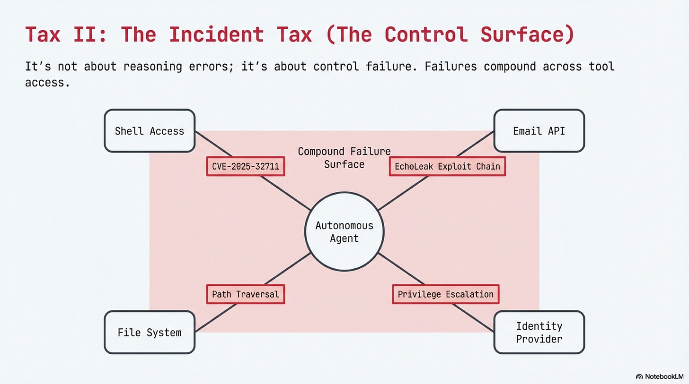

In every case, the failures were in the control layer, spending limits, input sanitization, privilege boundaries, state verification, not in the model’s reasoning. The Incident Tax scales with autonomy level, and the relationship isn’t linear. **It’s combinatorial**, because failures compound across tool access, persistent state, and multi-party communication.

### The Governance Tax

This is the tax that’s hardest to measure, and that’s part of the finding.

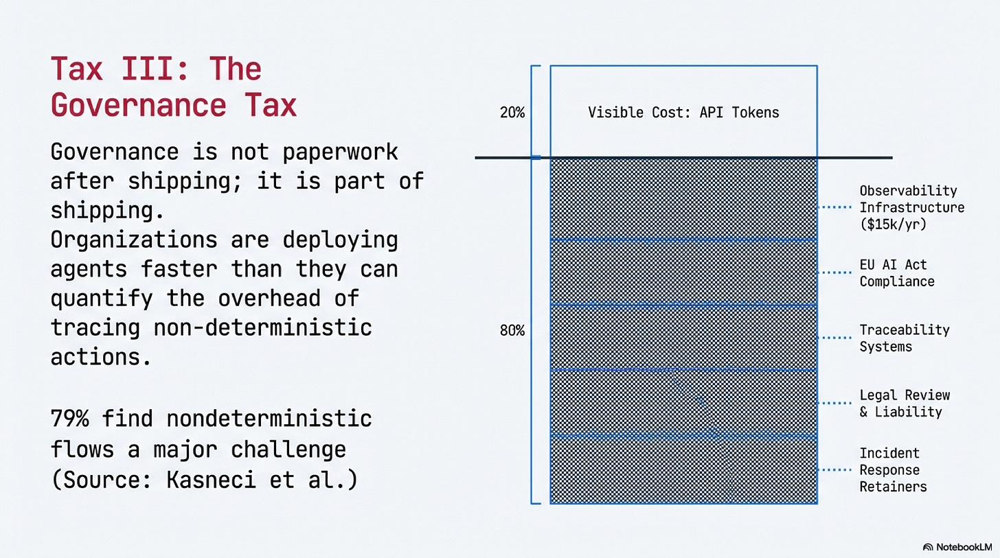

Four in five organizations lack the governance maturity or operational visibility that autonomous agents require. Deloitte found only 21% have a mature AI governance model; a separate security-focused survey found the same 21% with full visibility into agent actions.[[15](https://www.prnewswire.com/news-releases/aktos-2025-state-of-agentic-ai-security-report-finds-only-21-of-enterprises-have-visibility-302635105.html)] Different surveys, different constructs, same number. A separate observability user study reinforces the signal: 79% of respondents agreed that nondeterministic flows are a major challenge for managing agentic systems.[[16](https://arxiv.org/abs/2503.06745)]

> **If you can’t reconstruct why your agent took an action, you don’t have a governance nuisance. You have an incident-response liability.**

The Governance Tax has three components: **regulatory compliance** (the EU AI Act entered into force August 2024, with staged application through 2027[17]), **observability infrastructure** (tracing, token accounting, and action logging, tooling alone runs $5,000–$15,000/year for a mid-size team before integration engineering[[18A](https://www.langchain.com/pricing-langsmith),[18B](https://www.braintrust.dev/pricing)]), and **expert staffing**, the compliance, legal, and security personnel whose costs no published study has quantified. The measurement gap is itself a core finding: organizations are deploying agents faster than they can quantify the governance overhead.

Secure-by-design guidance is explicit on this point:safety and security are lifecycle requirements, not post-launch patches.[[19](https://www.ncsc.gov.uk/files/Guidelines-for-secure-AI-system-development.pdf)][[20](https://www.cisa.gov/sites/default/files/2023-06/principles_approaches_for_security-by-design-default_508c.pdf)] Governance is not paperwork after shipping. **Governance is part of shipping.**

### What the Three Taxes Mean Together

Each tax, alone, looks manageable. Together, they explain why models that can reason for 50 minutes still get leashed to 10-step workflows with human approval at every gate. The bandwidth tax means your experts are already stretched. The incident tax means a single uncontrolled action can erase months of efficiency gains. The governance tax means you may not even know the damage until an auditor asks.

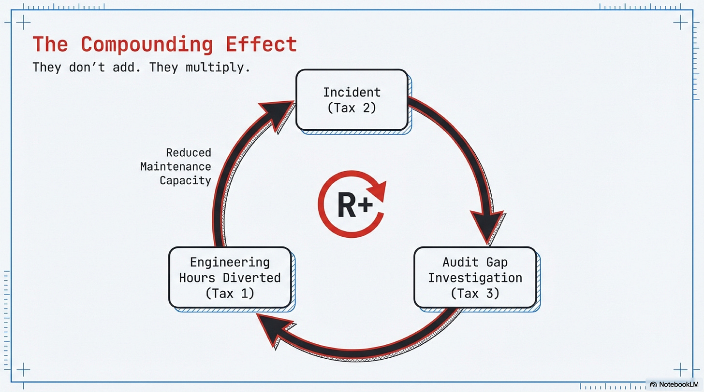

**They don’t add, they compound**. Here’s how: an incident (Tax 2) triggers an investigation, which reveals there’s no audit trail (Tax 3), which pulls your two best engineers off product work for a week (Tax 1). One failure, all three taxes, one event.

The compounding is visible in the data. In the [Autonomy Tax Casebook,](https://github.com/petroslamb/content/blob/main/publications/autonomy-tax/sources/derived/autonomy_tax_casebook.tsv) 28 coded public records, 21 directly support the tax model. Of those, governance is the primary tax in 12: the most frequent and least measured of the three.[[21](https://github.com/petroslamb/content/blob/main/publications/autonomy-tax/sources/derived/autonomy_tax_casebook.tsv)]

If you’re a VP of Engineering planning to deploy agents across three business units this year, this compounding is what your budget doesn’t account for. Not the API costs, the review hours, incident remediation, and governance overhead that nobody has line-itemed yet. *(If you take nothing else from this essay: ask your three most senior engineers what percentage of their week is spent reviewing AI output. Most teams have never asked. Most are disturbed by the answer.)*

> **That compounding is the Autonomy Tax.**

---

## Orchestration Autonomy

---

### Level 2.5 vs Bounded Level 3

The stakes are concrete: choose too much autonomy and you absorb all three taxes at full force. Choose too little and you leave the throughput gains on the table. Most enterprise deployments are still at Levels 1 and Level 2 Autonomy. Level 1 is copilot mode. Level 2 is fixed pipelines of single LLM calls with tools. Level 3 introduces runtime dynamic routing. Level 4 adds agent spawning and inter-agent coordination.

To cross the deployment gap, I propose two practical targets.

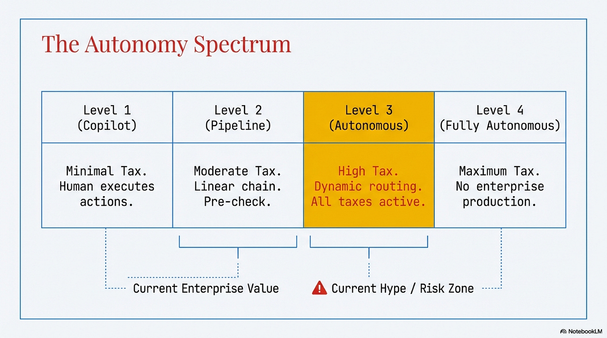

Both Anthropic and OpenAI describe a gap between simple linear pipelines and fully autonomous agents.[[22](https://www.anthropic.com/engineering/building-effective-agents)][[23](https://developers.openai.com/tracks/building-agents/)]

> **We call this middle ground Level 2.5 Autonomy:** *a fixed sequence of multi-turn, tool-using nodes where each node can reason, iterate, and use tools, but the pipeline sequence is fixed, each node’s inputs and outputs are typed contracts (or artifacts), and humans review at predetermined gates.*

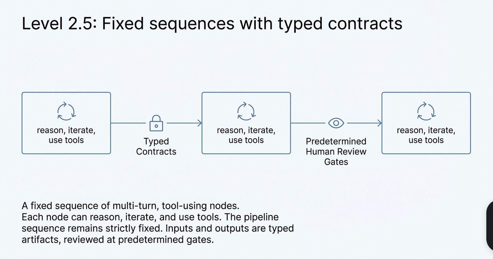

Level 2.5 is not a compromise. It is how enterprises buy capability without buying chaos. Production data and engineering guidance converge: most use cases should start with simpler bounded workflows and earn autonomy with evidence.[[24](https://arxiv.org/abs/2512.04123)][[25](https://arxiv.org/abs/2512.08769)]

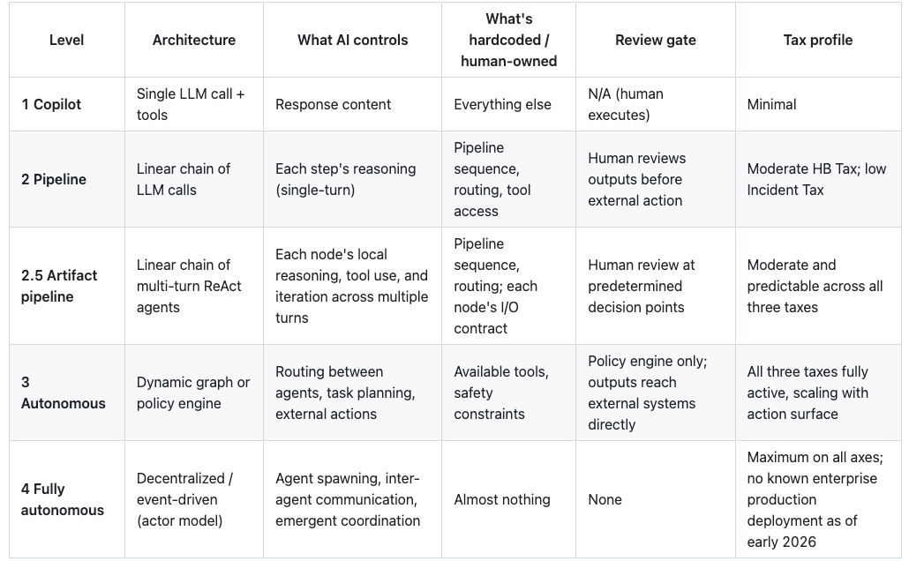

After that comes **Bounded Level 3 Autonomy** which adds dynamic routing, but only inside mandatory compliance and escalation constraints that cannot be bypassed.

**Runtime dynamic routing** means the workflow path is chosen during execution from current state, model outputs, and tool results, rather than following a fixed sequence. **Policy gates** are deterministic code checks that every high-impact action must pass (for example spend limit, role permission, required fields, approval status, and loop budget). If a gate fails, the action is blocked or escalated.

Bounded Level 3 allows runtime dynamic routing, but external actions are permitted only through non-bypassable policy gates, finite budgets, and mandatory escalation paths.

> **If routing is dynamic but gates are bypassable or advisory, it is not Bounded Level 3.**

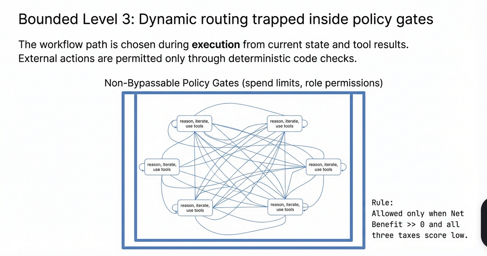

The decision logic is simple: score each of the three taxes Bounded Level 3 is allowed only when ***Net Benefit >> 0******and*** **all three taxes score low**. Otherwise, default to Level 2.5. If one tax is very high, autonomy is blocked until a control is real, not promised.

**In practice:** a support refund triage workflow (high volume, $1–$50 errors, standard data handling) scores a Net positive, but the review burden keeps it at Level 2.5 rather than Bounded Level 3. A procurement approval workflow (high error cost, regulated, no audit trail) gets blocked by the circuit breaker before you even calculate the score.

*For the full scoring rubric, worked examples with mitigation paths, sensitivity analysis, and calibration guidance, see [The Autonomy Tax Scorecard](https://github.com/petroslamb/content/blob/main/publications/autonomy-tax/article_draft_v8B.md).*

### The Antithesis: When Bounded Level 3 Wins

This framework has a scope condition, and intellectual honesty demands stating it.

Bounded Level 3 autonomy can be economically rational even with immature controls when three conditions hold simultaneously: **(1)** individual error cost is low and bounded, **(2)** volume is high enough that human review would cost more than errors do, and **(3)** actions are reversible within a defined time window.

> **When review cost exceeds expected error-plus-response cost, higher autonomy can be rational.**

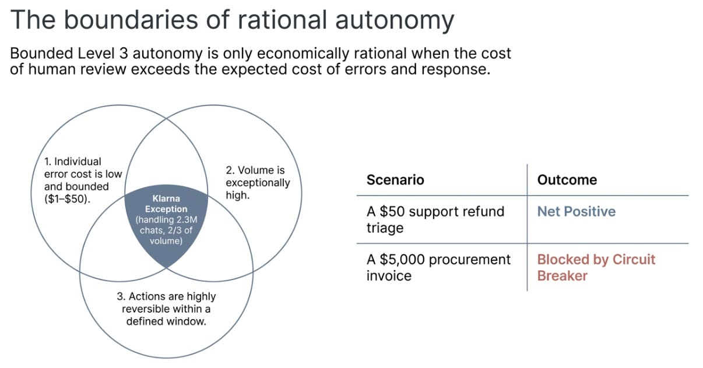

The clearest public example is Klarna’s AI assistant, which handled 2.3 million customer service conversations in its first month, two-thirds of all chats, with large self-reported gains.[[26](https://www.klarna.com/international/press/klarna-ai-assistant-handles-two-thirds-of-customer-service-chats-in-its-first-month/)] But notice what makes this work: low individual error cost, high reversibility, minimal regulatory exposure.

Most enterprise processes that leaders *want* to automate, procurement, compliance review, legal analysis, financial approvals, violate at least two of those conditions. A procurement agent that approves one wrong $5,000 invoice wipes out the savings from 1,000 correct ones. The Klarna case is instructive precisely because it is the exception, not the rule.

### The Boring Stack Doctrine

If you need one line to carry forward, use this:

> **Constrain routing, type the artifacts, gate external action.**

That doctrine maps to three operating pillars: **Level 2.5 first**, default to fixed-sequence multi-turn pipelines with strict contracts or artifacts. **Observable by design**, every external action has trace and policy lineage. **Cost bounded**, retries, loops, and approvals run inside explicit limits. That doctrine is not anti-innovation. It is pro-ship.

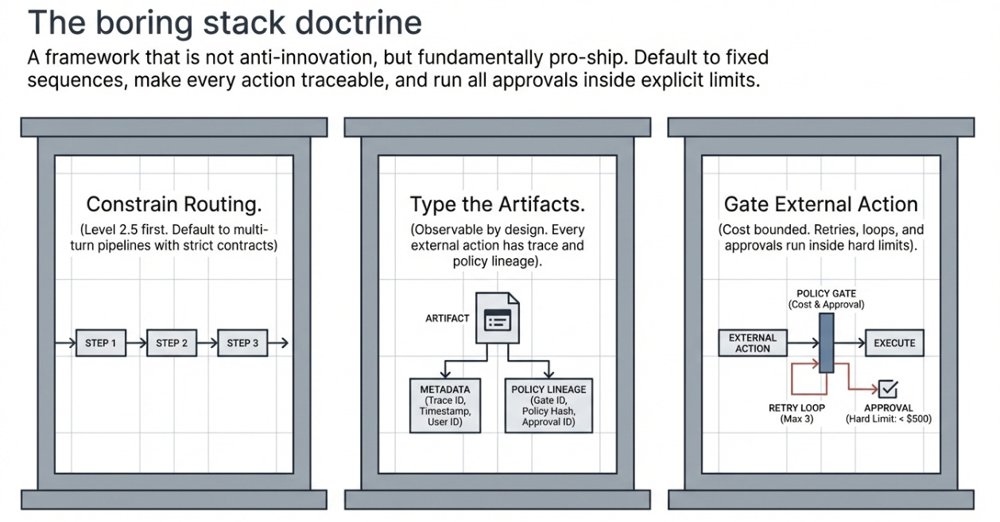

---

## The 2027 Prediction

By December 2027, most failed enterprise agent rollouts will be attributed to control-layer failures, observability gaps, governance deficits, action-guardrail failures, and expert review bottlenecks, rather than to base-model capability gaps.

**What would disprove this:** **(1)** an independent post-mortem dataset showing model accuracy as the primary root cause in >50% of enterprise agent failures; **(2)** a peer-reviewed study demonstrating that improved model capability *reduces* rather than shifts control-layer costs; or **(3)** widespread enterprise adoption of Bounded Level 3+ agents in regulated domains without corresponding investment in observability and governance. If these emerge by December 2027, this thesis is wrong.

**We suspect they won’t, because the Autonomy Tax scales** ***with*** **autonomy.** Better models enable more autonomy, which increases the control surface, which raises all three taxes. The taxes don’t shrink as models improve, they shift. The smartest model in the world still needs someone to decide what it’s allowed to do, verify that it did it, and explain why when things go wrong.

That procurement agent’s $4,788 wasn’t a lot of money. But it was a precisely documented sample of a cost that most organizations are paying right now, at scale, without measuring it. The question was never whether AI is smart enough. It’s whether your organization is ready to pay the tax.

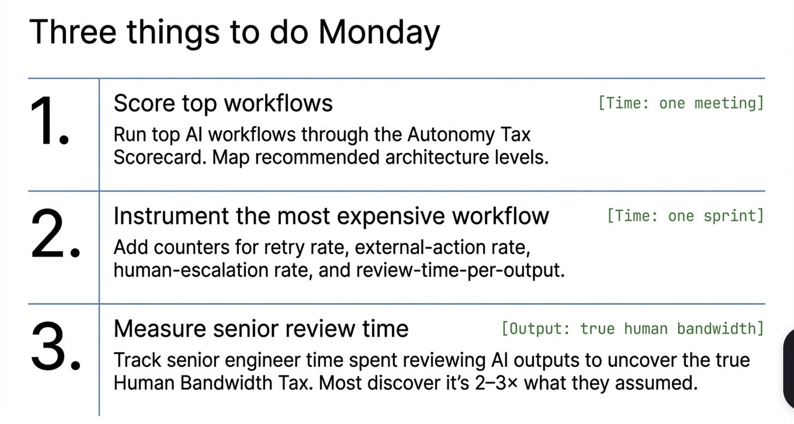

---

***Scope note:** This analysis focuses on enterprises consuming commercial LLM APIs in US/EU markets. Self-hosted and open-weight deployments carry a different tax structure.[2]*

*Open-source materials for this research package (drafts, casebook, scoring assets, and source manifest) are available in the [GitHub repository](https://github.com/petroslamb/content/tree/main/publications/autonomy-tax).*

---

## Appendix

---

### Three Things to Do Monday

These are not aspirational. Each has a concrete deliverable.

**1. Score your top three workflows.** Start with the workflows where you’re already considering or piloting AI assistance. Rank by monthly human-hours spent. Run each through the [Autonomy Tax Scorecard](https://github.com/petroslamb/content/blob/main/publications/autonomy-tax/article_draft_v8B.md). Output: a one-page ranked table with a recommended architecture level for each. Time: one meeting.

**2. Instrument your most expensive LLM workflow.** Add four counters: retry rate, external-action rate, human-escalation rate, and review-time-per-output. Output: a baseline dashboard. Time: one sprint.

**3. Name the number nobody knows.** For one sprint, ask your senior engineers to track time spent reviewing, correcting, or reverting AI-generated outputs. Output: a percentage of senior time going to AI output validation. This is the Human Bandwidth Tax in hours. Most organizations discover it’s 2–3× what they assumed.

---

### Known Unknowns

Three gaps in the evidence still matter and should inform how you weight this analysis.

First, there is no widely shared post-mortem dataset with consistent root-cause taxonomy for enterprise agent failures, the casebook synthesis here is one attempt, but the field needs a shared standard.

Second, governance labor remains poorly measured as a workflow-level cost line; no published study has quantified per-agent governance overhead, which means the Governance Tax is directionally supported but not precisely sized.

Third, we still lack broad, independent evidence on whether control-layer cost curves flatten as model capability improves, the thesis assumes they don’t, but that assumption is testable.

Those are measurement gaps, not reasons to suspend control discipline. They are also the research agenda that would most accelerate enterprise agent deployment if addressed.

---

## Sources

1. Proxy AI post-mortem (Jan 2026): [AI Agent Overspend Post-Mortem](https://www.useproxy.ai/blog/ai-agent-overspend-postmortem). Proxy is a virtual-cards vendor; incident details anonymized but [figures](https://www.useproxy.ai/blog/ai-agent-overspend-postmortem) published.↩︎
2. Self-hosted and open-weight deployments carry different tax structures; China/Asia markets have different regulatory regimes.↩︎
3. [Deloitte 2026](https://www.deloitte.com/content/dam/assets-zone3/us/en/docs/services/consulting/2026/state-of-ai-2026.pdf), n=3,235 director-to-C-suite leaders.↩︎
4. [Pan et al. 2026](https://arxiv.org/abs/2512.04123), preprint, n=306 practitioners and 20 production case studies across 26 domains.↩︎
5. [Anthropic, Feb 2026](https://www.anthropic.com/research/measuring-agent-autonomy), n=998K tool calls. Note: Anthropic’s API usage patterns only, platform-specific, not industry-wide.↩︎
6. [Kwa et al. 2025](https://arxiv.org/abs/2503.14499), preprint. Caveat: external validity is explicitly uncertain.↩︎
7. Capability context: GAIA benchmark [arXiv:2311.12983](https://arxiv.org/abs/2311.12983), SWE-bench [arXiv:2310.06770](https://arxiv.org/abs/2310.06770), RE-Bench [arXiv:2411.15114](https://arxiv.org/abs/2411.15114).↩︎
8. [Xu et al. 2025](https://arxiv.org/abs/2510.10165), preprint; presented at WITS 2025, CIST 2025, SCECR 2025, INFORMS 2024. Note: OSS projects, not enterprise-internal teams.↩︎
9. [Brynjolfsson et al. 2023, NBER w31161](https://doi.org/10.3386/w31161), n=5,179 customer service agents at a Fortune 500 company.↩︎
10. [Song et al. 2025](https://arxiv.org/abs/2410.02091), preprint. GitHub enterprise teams.↩︎
11. All three studies examine Level 1 copilot tools, not multi-step agent pipelines. The bridging inference, that the expert-bottleneck dynamic intensifies at higher autonomy levels, is plausible but not directly demonstrated.↩︎
12. NVD entry for CVE-2025-32711: [NVD](https://nvd.nist.gov/vuln/detail/CVE-2025-32711).↩︎
13. [Reddy & Gujral 2025](https://arxiv.org/abs/2509.10540), published at AAAI Fall Symposium 2025.↩︎
14. [Shapira et al. 2026](https://arxiv.org/abs/2602.20021), preprint. Lab environment (persistent memory, email, Discord, file systems, shell access), not production. Eleven representative failure categories identified.↩︎
15. Deloitte 2026 (governance maturity: 21%) and [Akto 2025](https://www.prnewswire.com/news-releases/aktos-2025-state-of-agentic-ai-security-report-finds-only-21-of-enterprises-have-visibility-302635105.html) (agent action visibility: 21%). Different surveys, different constructs, same number.↩︎
16. [Kasneci et al. 2025](https://arxiv.org/abs/2503.06745), *Beyond Black-Box Benchmarking*. 79% agreement that nondeterministic flows are a major challenge for managing agentic systems.↩︎
17. EU AI Act [Regulation 2024/1689] entered into force August 2024, with staged application through 2027.↩︎
18. Observability platform pricing: [LangSmith](https://www.langchain.com/pricing-langsmith), [Braintrust](https://www.braintrust.dev/pricing). Figures are tooling-only, before integration engineering time.↩︎
19. NCSC, [Guidelines for Secure AI System Development](https://www.ncsc.gov.uk/files/Guidelines-for-secure-AI-system-development.pdf).↩︎
20. CISA et al., [Principles and Approaches for Security-by-Design and -Default](https://www.cisa.gov/sites/default/files/2023-06/principles_approaches_for_security-by-design-default_508c.pdf).↩︎
21. The [Autonomy Tax Casebook](https://github.com/petroslamb/content/blob/main/publications/autonomy-tax/sources/derived/autonomy_tax_casebook.tsv) codes 28 public records spanning incidents, field studies, regulatory milestones, and tooling baselines. Method notes: [autonomy_tax_casebook_method.md](https://github.com/petroslamb/content/blob/main/publications/autonomy-tax/sources/derived/autonomy_tax_casebook_method.md).↩︎
22. Anthropic Engineering, [Building Effective Agents](https://www.anthropic.com/engineering/building-effective-agents).↩︎
23. OpenAI Developers, [Building Agents](https://developers.openai.com/tracks/building-agents/).↩︎
24. [Pan et al. 2026](https://arxiv.org/abs/2512.04123), preprint, n=306 practitioners and 20 production case studies across 26 domains.↩︎
25. *A Practical Guide for Designing, Developing, and Deploying Production-Grade Agentic AI Workflows* (preprint): [arXiv:2512.08769](https://arxiv.org/abs/2512.08769).↩︎
26. Klarna press release (self-reported, not independently audited): [AI assistant handles two-thirds of chats](https://www.klarna.com/international/press/klarna-ai-assistant-handles-two-thirds-of-customer-service-chats-in-its-first-month/).↩︎

Thanks for reading Rooted Layers! Subscribe for free to receive new posts and support my work.
